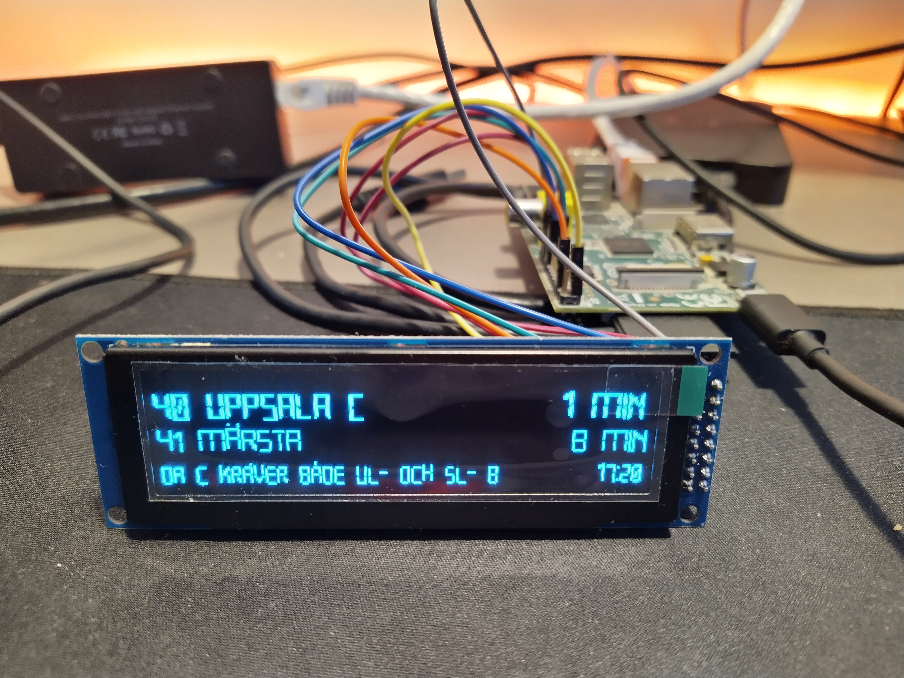

Pendeltåg
=========

Introduction
------------

Pendeltåg creates a live train station sign for the Stockholm commuter train. 
The project is heavily inspired by [this article](https://www.balena.io/blog/build-a-raspberry-pi-powered-train-station-oled-sign-for-your-desk/). 

The project relies on the information exposed through the [trafiklab.se](https://www.trafiklab.se/api) APIs which give live access to departures information, network distruptions and so on.
The APIs are free to use, but you need to register an account and get an API token to be able to use them.



Installation
------------

Create a virtualenv and install the requirements: 

```
virtualenv env
source env/bin/activate
pip install -r requirements.txt
```

Configuration
-------------

It expects a configuration file named (config.ini) which should look like the following:

```
[API_KEY]
stations = 
traffic = 

[LINE]
station = Helenelund Station
line_numbers = 41,42X
type = train 
direction = 2
time_window = 59
cutoff_min = 10

[APP]
refresh_min = 2
```

`stations` should contain the API Key for: [SL Platsuppslag](https://www.trafiklab.se/api/sl-platsuppslag)

`traffic` should contain the API Key for: [SL Realtidsinformation](https://www.trafiklab.se/api/sl-realtidsinformation-4) 

The `[LINE]` section allows to select the station and the line(s) to monitor. In the example above `Helenelund Station` is monitored and departures are filtered by `line_numbers`, `type`, `direction`. 

You can specify the time window to monitor (`time_window`) even thought the display will only show the next two departures. 

`cutoff_min` allows to filter out all the departures between now and now + cutoff. That's useful if, like me, you have to walk X minutes to reach the station.

`[APP]` provides configuration regarding the application itself. `refresh_min` specify the number of minutes between requests to the APIs. Lower tiers of the APIs have limited monthly requests.

Software
--------

Pendeltag is written in Python. It relies on [luma-oled](https://luma-oled.readthedocs.io/en/latest/) to handle the communication with the display. 
The code is formatted using [black](https://pypi.org/project/black/) and uses [mypy](https://pypi.org/project/mypy/) for static typing

The font used for the display is [Open 24 Display ST](https://www.dafont.com/open-24-display-st.font) which is available for free for personal use. 

Hardware
--------

I used the same type of display as the original article: SSD1322 OLED which I got form [AliExpress](https://www.aliexpress.com/item/32988174566.html).

The display came in a 8088 configuration, to use it with a SPI-4 configuration I moved the jumper according to the data sheet on the board itself. 

I have an old Raspberry PI which has a 26 GPIO output, so my configuration might be different if you have a newer Raspberry PI. The [original article](https://www.balena.io/blog/build-a-raspberry-pi-powered-train-station-oled-sign-for-your-desk/) has the connection layout for the new Raspberry PI Zero.

| PIN Display | Pin Raspberry | Connection |
|-------------|---------------| -----------|
| 1           | 6             | Ground     |
| 2           | 1             | 3.3V       |
| 4           | 23            | SCLK       |
| 5           | 19            | MOSI       |
| 14          | 18            | BCM24      |
| 15          | 22            | BCM25      |
| 16          | 24            | CE0        |


SPI interface was not enabled on my card, if that's the case, you can use `raspi-config` to enable it. You can follow [this documentation](https://luma-oled.readthedocs.io/en/latest/hardware.html#enabling-the-spi-interface). If it's enabled you should see the following devices:

```
$ ls -l /dev/spi*
crw-rw---- 1 root spi 153, 0 Nov 25 08:32 /dev/spidev0.0
crw-rw---- 1 root spi 153, 1 Nov 25 08:32 /dev/spidev0.1
```